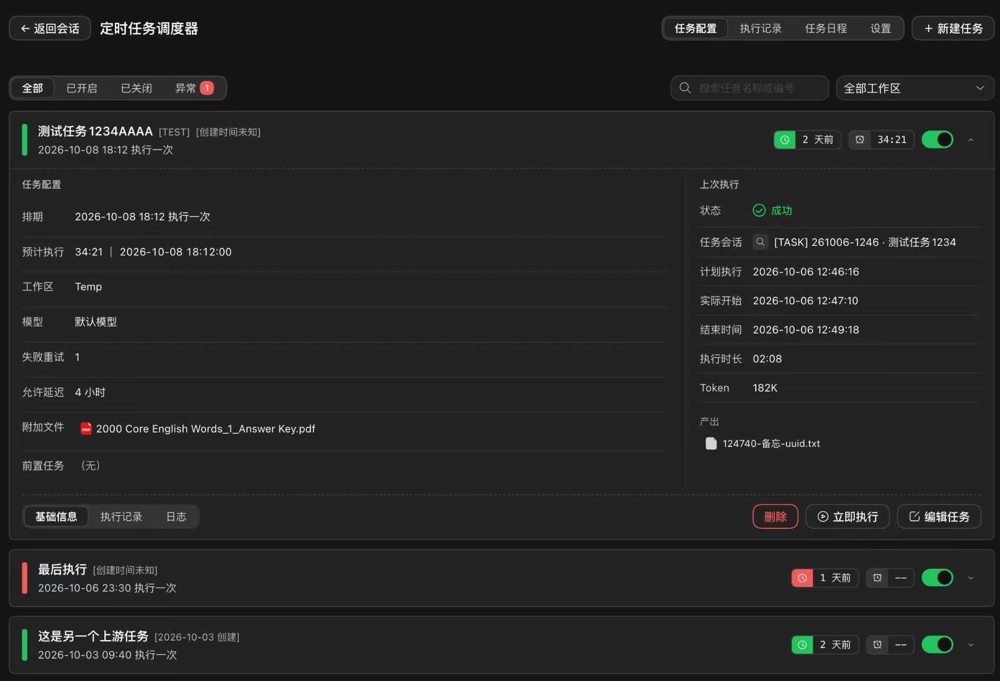
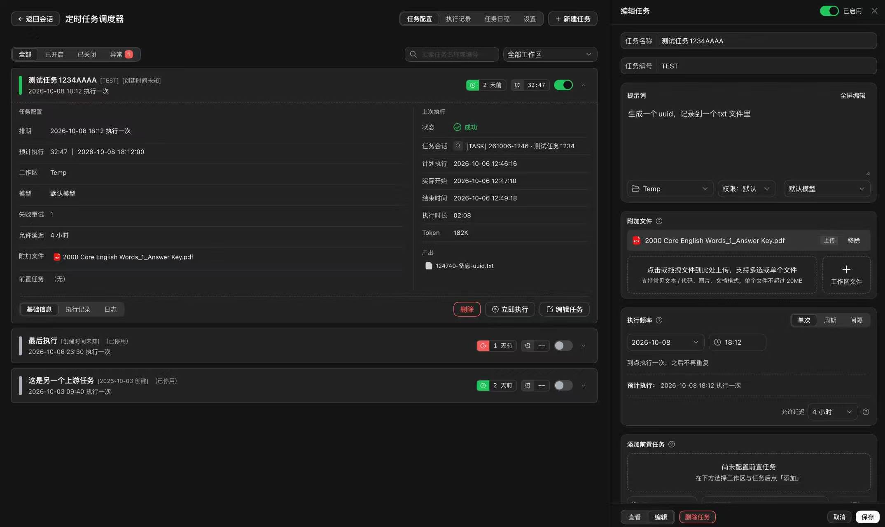
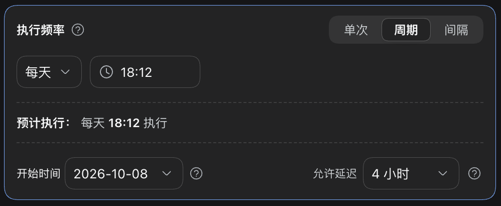
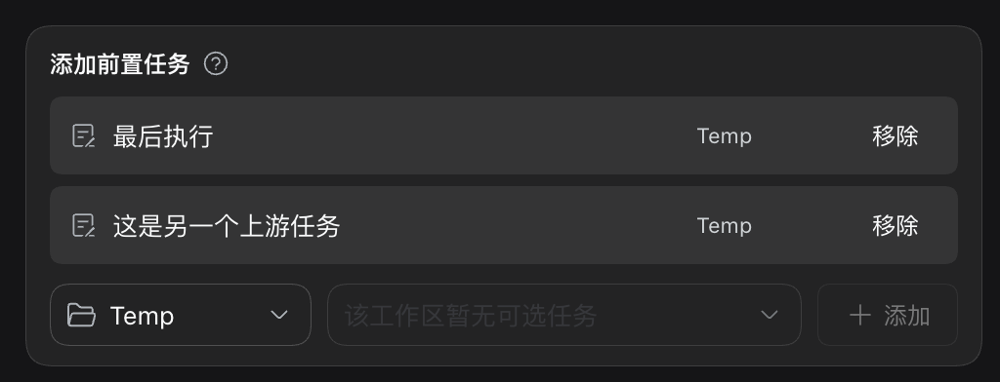
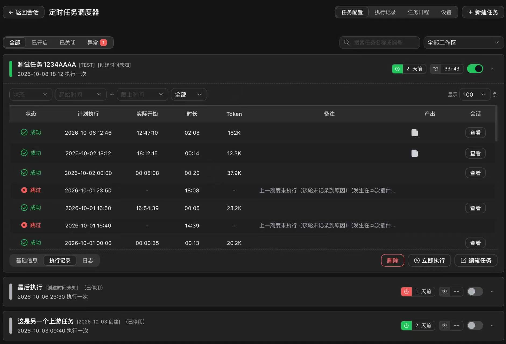
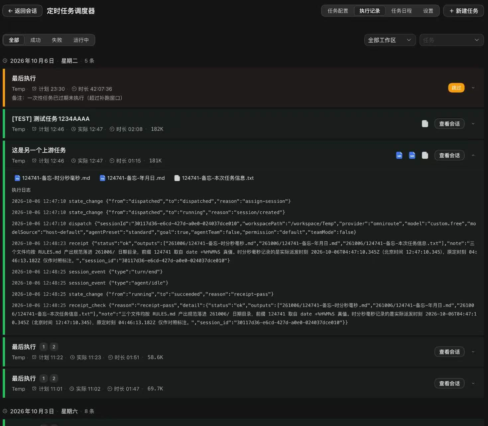
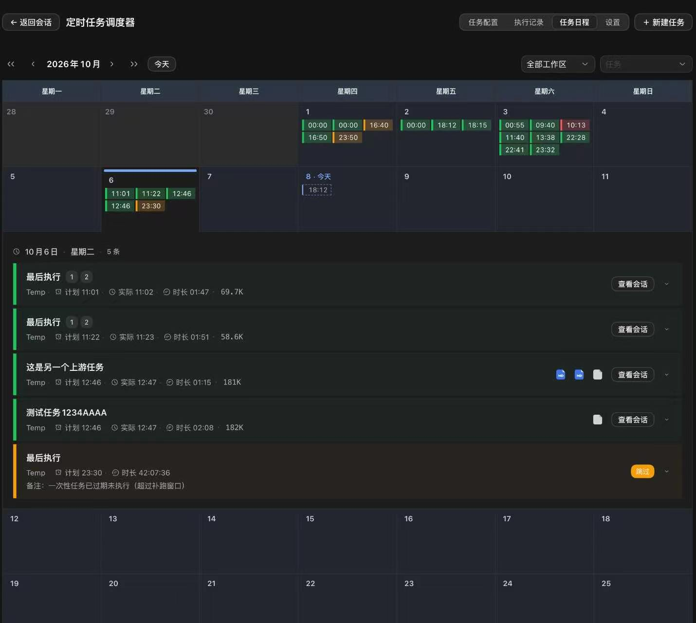
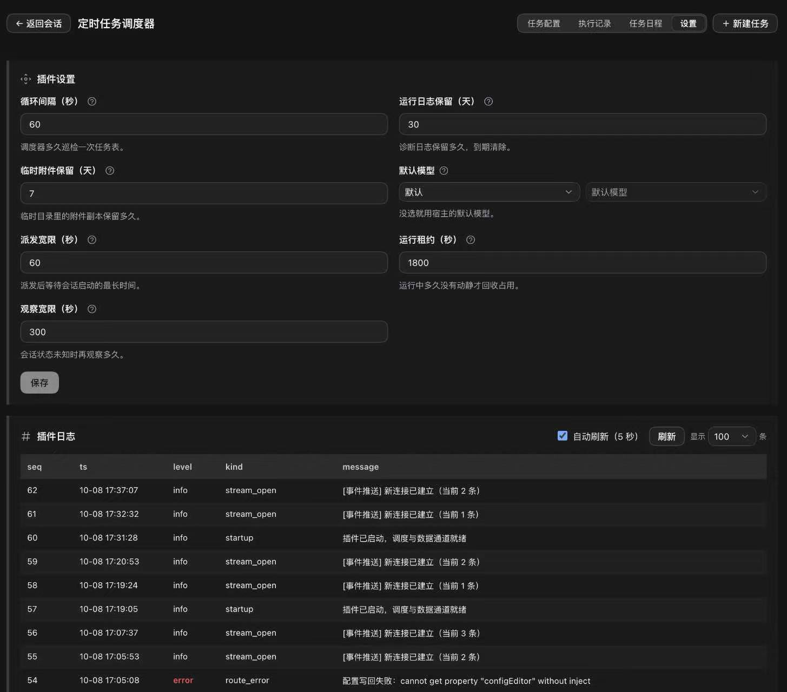

# dsh-task-dispatch-table · 定时任务调度器

[English](README.md) | 中文

一个 dsh 宿主层插件：用**一张任务定义表驱动周期性的 agent 工作**——任务到点后被派发成一个**独立的 dsh 会话**，由 agent 真正执行。调度本身是纯程序逻辑，**一行 token 都不烧**。



- **调度零大模型介入**——tick → 判时间窗 → 判依赖 → 派发。判断类工作交给 agent 会话，「什么时候该跑」这个决定不花一分钱
- **三种排期模式**——单次、cron 式每天/每周、每 N 小时间隔，每种都带**允许延迟窗口**：宿主忙不过来时补跑，而不是悄悄跳过
- **依赖由下游声明**——任务可以要求上游任务执行成功才放行；派发瞬间**冻结命中的上游实例及其产出**，随任务下传给下游会话
- **每次执行都是独立会话**——有自己的状态、token 用量、产出物和事件流水，事后可查、失败可重试、任务内串行
- **完整的界面**——任务列表、单任务执行记录与日志、跨任务执行流水账、月历日程、分栏编辑器、设置页

## 安装

```bash
dsh plugin --profile web add dsh-task-dispatch-table
```

每个版本都发布到 npm，装完即用——无需额外配置、无需本地构建。界面文案**中英双语**，跟随 dsh 的界面语言（设置 → 通用 → 语言）。

## 它是怎么工作的

插件维护两层状态：

| 对象 | 代表什么 | 决定什么 |
| --- | --- | --- |
| **任务定义** | 每个调度单元一行：标题、提示词、排期、附件、工作区、模型、依赖、开关 | 任务**该不该跑、怎么跑** |
| **执行记录** | 每次实际触发一行：状态、计划/实际时间、会话 id、token 用量、产出物 | 这趟**实际发生了什么** |

调度器是一个朴素的循环：每个 tick 算出哪些任务到点，在 SQLite 里原子领取，把每个任务派发成其工作区里的一个新 dsh 会话，再通过一个回执工具跟踪会话（会话干完活必须调它）。错过的刻度（宿主停机超出允许延迟）会补一条记录并标 `skipped`（带原因），而不是无声消失。

## 任务

### 新建与编辑



点**新建任务**（或卡片上的**编辑**），编辑器以分栏形式打开（不是浮层抽屉）：基础、排期、提示词（带版本）、高级选项、附加文件、前置任务。附加文件两种来路：**link**（工作区已有文件，只记路径）与 **upload**（落盘到任务自己的目录，单个不超过 20 MB）。

底栏可在**查看 / 编辑**两档切换：查看档 = 只读人话视图——配置、上次执行、提示词，用于检查任务而不怕误改。

### 排期



三种模式，每种都用一句人话预览下次执行：

- **单次**——到点执行一次，之后不再重复
- **周期**——每天 / 每周 / 每月的固定时刻
- **间隔**——每 N 小时（或天），可选限定星期几

每种模式都带**允许延迟**：到点时宿主忙或停机了，窗口内仍然补跑；超出窗口则该刻度记 `skipped`（带原因），不是无声丢掉。任务卡片上的**立即执行**按钮可以在排期之外马上补跑一趟。

### 依赖（前置任务）



任务声明哪些上游任务必须执行成功它才放行（Airflow / GitHub Actions `needs` 的模型——**由下游声明，加下游不动上游**）。任务触发时，插件冻结「命中了哪条上游实例」及其产出，一并传进新会话——下游 agent 读到的就是它这趟所键定的那份数据，哪怕上游后来又跑过。

## 执行与记录

### 单任务



展开任务有三个面板：**基础信息**（任务配置与上次执行并排）、**执行记录**（每次执行一行：状态、计划/实际时间、时长、token 用量、产出物，以及打开归档会话的按钮）、**日志**（该任务专属的诊断日志——错过的刻度、附件缺失、手动执行等）。

### 执行记录（流水账）



顶部 **执行记录** tab 是全部任务的总账：按天分组，支持时间 / 工作区 / 状态 / 任务四维过滤。每条就地展开，给出完整产出物列表与原始事件流水（状态迁移、派发记录、回执）；按**查看会话**才打开归档会话本体。

### 任务日程（月历）



顶部 **任务日程** tab 是月视图。格子里有两类标记：**已执行**（来自实例表的状态色实心点）与**计划**（按当前任务定义现算的虚线空心点）。点某天，那一天所在的一周就地拉开，铺开全部执行信息——与流水账同款条目块，可再展开到产出物与事件。

## 配置



顶部 **设置** tab 是配置的正式主场。每项标注是否「自定义」、可单独恢复默认；改动先暂存、点**保存**才写入；下方日志块带 level 语义着色与自动刷新。

| 项 | 默认 | 含义 |
| --- | --- | --- |
| 循环间隔 | 60 秒 | 调度器多久巡检一次任务表 |
| 运行日志保留 | 30 天 | 诊断日志留多久 |
| 临时附件保留 | 7 天 | 上传的临时文件留多久 |
| 默认模型 | 跟随宿主 | 任务未指定模型时用哪个 |
| 派发宽限 | 60 秒 | 派发后等会话出现的最长时间 |
| 运行租约 | 1800 秒 | 运行中会话多久没动静才被收回 |
| 观察宽限 | 300 秒 | 会话状态未知时观察多久再判死 |

配置存在插件自有状态库里，不随宿主配置重置而丢；其下始终有默认值兜底。

## 开发

```bash
npm install
npm run build        # 先构建 host，再构建 client
npm run typecheck
npm run smoke        # 直接测 dist/ 产物
```

> **`dist/` 是提交进 git 的构建产物**——dsh 从 git/npm 安装插件时不跑构建脚本，所以改了 `src/` 必须重新 `npm run build` 并把 `dist/` 一并提交，否则改动不生效。

## License

[MIT](LICENSE) © 2026 cq-guojia
